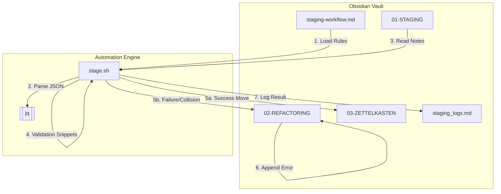

# Obsidian Staging Automation Brownfield Enhancement Architecture

## 1. Introduction

This document outlines the architectural approach for enhancing **Obsidian Staging Automation** with **Automated note staging via a POSIX-compliant shell script**. Its primary goal is to serve as the guiding architectural blueprint for AI-driven development of new features while ensuring seamless integration with the existing system.

**Relationship to Existing Architecture:**
This document supplements existing project architecture by defining how new components will integrate with current systems. Where conflicts arise between new and existing patterns, this document provides guidance on maintaining consistency while implementing enhancements.

**Existing Project Analysis**
Based on my analysis of your project, I've identified the following about your existing system:
*   **Primary Purpose:** Automate Obsidian note staging and filing into a Zettelkasten structure.
*   **Current Tech Stack:** POSIX `sh` (Strict compliance required for iOS `a-shell`), `jq` (1.6+).
*   **Architecture Style:** Script-based automation using "Configuration as Code" (JSON embedded in Markdown).
*   **Deployment Method:** Local execution on Linux (WSL) and iOS (`a-shell`).
*   **Identified Constraints:** Strict POSIX compliance (no bashisms), cross-platform `sed` compatibility (BSD vs GNU), `jq` dependency, and stateless configuration re-reads.

## 2. Change Log

| Change | Date | Version | Description | Author |
| :--- | :--- | :--- | :--- | :--- |
| Initial Architecture | 2026-01-19 | 1.0 | Initial architecture for Obsidian Staging Automation | Architect Agent |

## 3. Enhancement Scope and Integration Strategy

**Enhancement Type:** New Feature Addition (Automation Script)
**Scope:** Create `stage.sh` and `staging-workflow.md` to automate file movement from `01-STAGING` to `03-ZETTELKASTEN`.
**Integration Impact:** Moderate. Adds new tooling without modifying existing core system architecture.

**Integration Approach**
*   **Code Integration Strategy:** Standalone shell script `misc/obsidian/infrastructure/scripts/stage.sh`.
*   **Database Integration:** File-system based (Obsidian Vault).
*   **UI Integration:** CLI execution via `a-shell` or terminal. "Configuration as Code" provides a pseudo-UI for rule management inside Obsidian.

**Compatibility Requirements**
*   **Existing API Compatibility:** N/A.
*   **UI/UX Consistency:** Must follow Obsidian folder structure conventions.
*   **Performance Impact:** Must run efficiently on mobile hardware (iOS).

## 4. Tech Stack

| Category | Current Technology | Version | Usage in Enhancement | Notes |
| :--- | :--- | :--- | :--- | :--- |
| **Shell** | POSIX `sh` | N/A | Core logic execution | Must remain compatible with `a-shell`. |
| **JSON Parser** | `jq` | 1.6+ | Configuration & Data extraction | Essential for parsing YAML-to-JSON and the config MD. |
| **Text Processing** | `sed` / `awk` | POSIX | Frontmatter extraction/Error injection | Must avoid GNU-specific or BSD-specific extensions. |
| **Data Storage** | Markdown Files | N/A | Input/Output/Config | The Obsidian vault is the primary data store. |

## 5. Data Models and Schema Changes

**Staging Configuration (JSON Schema)**
*   **Purpose:** Defines the routing and validation rules for each note type.
*   **Key Attributes:**
    *   `TypeString`: Root key matching the `Type` field in note frontmatter.
    *   `destination`: String path relative to vault root.
    *   `fields`: Object containing `fieldName: validation_snippet` pairs.

**Note Frontmatter (Note Schema)**
*   **Key Attributes:**
    *   `Type`: String (Mandatory).
    *   `ID`: String (Unique identifier, typically `YYYYMMDDHHMMSS`).

**Schema Integration Strategy**
*   **Migration Strategy:** Stateless. New notes simple follow the new schema.
*   **Backward Compatibility:** The script only acts on files in `01-STAGING`.

## 6. Component Architecture

**New Components**

**Note Stager Engine (`stage.sh`)**
*   **Responsibility:** The core orchestration engine. Handles environment validation, config loading, validation execution, and file system operations.
*   **Key Interfaces:** `load_config()`, `validate_note()`, `process_file()`.

**Workflow Configuration (`staging-workflow.md`)**
*   **Responsibility:** Provides the routing and validation rules in a user-editable format.

**Component Interaction Diagram**


## 7. Source Tree

```plaintext
/home/lw/.config/home-manager/
├── misc/
│   └── obsidian/
│       ├── infrastructure/
│       │   ├── scripts/
│       │   │   └── stage.sh           # Core automation script
│       │   └── staging-workflow.md    # JSON configuration (Markdown)
│       └── logs/
│           └── staging_logs.md        # Run history
```

## 8. Infrastructure and Deployment Integration

**Deployment Approach**
Manual execution via terminal (`a-shell` on iOS, Bash on Linux). Vault root resolved via 1) Argument, 2) Env Var, 3) Auto-detection.

**Rollback Strategy**
Manual move-back from `03-ZETTELKASTEN` or `02-REFACTORING` to `01-STAGING`.

## 9. Coding Standards

**Modern POSIX `sh` Style**
*   **Structure:** Header -> Environment -> Utilities -> Logic Functions -> `main()`.
*   **Indentation:** 2-space indentation.
*   **Logging:** Timestamped and leveled (e.g., `[INFO]`).
*   **POSIX Constraints:** No bashisms (`[ ]`, no `local`, no arrays).
*   **Safety:** Mandatory variable quoting and portable `sed` patterns (Redirect and Move).

## 10. Testing Strategy

*   **Custom Test Suite:** `test-stage.sh` in `misc/obsidian/infrastructure/tests/`.
*   **Mock Environment:** Uses a temporary directory structure mimicking the vault.
*   **Dry-Run:** Mandatory verification before deployment.

## 11. Security Integration

*   **Snippet Validation:** Documentation must warn users that validation snippets run with full script permissions.
*   **Path Sanitization:** Prevent `destination` paths from escaping vault root.

## 12. Checklist Results Report

All items of the architect-checklist have been addressed with a focus on cross-platform POSIX compliance and data safety.

## 13. Next Steps

**Story Manager Handoff**
Implement **Epic 1: Automated Obsidian Staging Workflow**. Start with Story 1.1 (Infrastructure/Logging) and 1.2 (Test Data Generator).

**Developer Handoff**
Adhere strictly to the **Modern POSIX sh Style**. Verify all edge cases (collisions, missing fields, bad frontmatter) using the mock vault generator.
